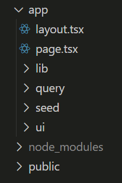

# Next.js App Router Course - Starter

This is the starter template for the Next.js App Router Course. It contains the starting code for the dashboard application.

For more information, see the [course curriculum](https://nextjs.org/learn) on the Next.js Website.

## Creating the Project

### Installing PNPM

- Open a Terminal and type:

```
npm install -g pnpm
```

### Installing the Project Example

- Open a Terminal and type:

```
npx create-next-app@latest nextjs-dashboard --example "https://github.com/vercel/next-learn/tree/main/dashboard/starter-example" --use-pnpm
```

## Exploring the Project

### Folders Structure


- **/app :** Contains all the routes, components, and logic for your application, this is where you'll be mostly working from.
- **/app/lib :** Contains functions used in your application, such as reusable utility functions and data fetching functions.
- **/app/ui :** Contains all the UI components for your application, such as cards, tables, and forms. To save time, we've pre-styled these components for you.
- **/public :** Contains all the static assets for your application, such as images.
- **Config Files :** You'll also notice config files such as next.config.ts at the root of your application. Most of these files are created and pre-configured when you start a new project using create-next-app. You will not need to modify them in this course.

<p align="center">
  
</p>

> **app/lib/definitions.ts :** This file manually define the types that will be returned from the database. For example, the invoices table has the following types:
```
export type Invoice = {
  id: string;
  customer_id: string;
  amount: number;
  date: string;
  // In TypeScript, this is called a string union type.
  // It means that the "status" property can only be one of the two strings: 'pending' or 'paid'.
  status: 'pending' | 'paid';
};
```

> Note: We're manually declaring the data types, but for better type-safety, we recommend Prisma or Drizzle, which automatically generates types based on your database schema.

> Note²: Next.js detects if your project uses TypeScript and automatically installs the necessary packages and configuration. Next.js also comes with a TypeScript plugin for your code editor, to help with auto-completion and type-safety.


## Running the Development Server

In your Terminal, type:
```
pnpm i
```

Next, type:
```
pnpm dev
```

## Style

- https://nextjs.org/docs/app/building-your-application/styling 

### CSS
### Tailwind

- https://tailwindcss.com/

- https://tailwindcss.com/docs/styling-with-utility-classes

```
<div className="flex h-20 shrink-0 items-end rounded-lg bg-blue-500 p-4 md:h-52">
```
### module.css

- https://nextjs.org/docs/app/getting-started/css

We need create a new file inside the /app/ui folder. For example: _home.module.css_ and add a style (in the example below, the style was named as _.shape_)
```
.shape {
  width: 0;
  height: 0;
  border-bottom: 30px solid black;
  border-left: 20px solid transparent;
  border-right: 20px solid transparent;
}
```
Next, we add the style in the code:
```
<div className={styles.shape} />
```

> The module.css method provides a way to make CSS classes locally scoped to components by default, reducing the risk of style conflicts.

## Fonts

### Google

To add Google Fonts to your Next.js application, follow these steps:

1. In your project's root layout file (`app/layout.tsx`), add the import at the top of the file:
```typescript
// app/layout.tsx
import { Inter } from 'next/font/google';
import type { Metadata } from 'next';
import './globals.css';

// Initialize the font
const inter = Inter({ 
  subsets: ['latin'],
  weight: ['400', '500', '600', '700'],
  display: 'swap',
});

export const metadata: Metadata = {
  title: 'Dashboard',
  description: 'Dashboard application',
};

export default function RootLayout({
  children,
}: {
  children: React.ReactNode;
}) {
  return (
    <html lang="en" className={inter.className}>
      <body>{children}</body>
    </html>
  );
}
```

> Note: In this project, we've pre-configured the Inter font in the `/app/ui` folder. You can find the font configuration in `app/ui/fonts.ts`.

> Note²: While we've organized the fonts in the UI folder for this project, you can also follow the structure shown above by adding the font configuration directly in your `layout.tsx` file. Both approaches are valid - it's just a matter of preference and project organization.

Project Structure:
```
app/
├── layout.tsx    <- Add font import and configuration at the top of this file
├── page.tsx
└── ...
```

Key benefits of using `next/font`:
- Zero layout shift: Fonts are optimized and self-hosted
- Built-in performance best practices
- Automatic self-hosting for any font file
- Built-in privacy with no external network requests
- Type safety with full TypeScript support

Additional Tips:
- You can use multiple fonts by importing and initializing them separately
- Fonts are automatically optimized and self-hosted in the `public` directory
- The `subsets` option helps reduce the font file size by only including the characters you need
- Use `display: 'swap'` to show a fallback font while the custom font loads
- You can apply different weights and styles using the `weight` and `style` options

You can find all available Google Fonts in the [Google Fonts directory](https://fonts.google.com/).

## Images

Next.js can serve static assets, such as images, under the top-level `/public` folder. Files inside `/public` can be referenced in your application.

### Basic Image Implementation

With regular HTML, you would add an image like this:
```html

```

However, this approach requires manual handling of:
- Responsive images for different screen sizes
- Image sizes for different devices
- Layout shift prevention while images load
- Lazy loading for images outside the viewport

### The Next.js Image Component

The `<Image>` component is an extension of the HTML `` tag and comes with automatic image optimization:

1. **Automatic Layout Shift Prevention**
   - Prevents layout changes while images are loading

2. **Responsive Image Resizing**
   - Automatically resizes images to avoid sending large images to devices with smaller viewports

3. **Lazy Loading**
   - Images are loaded as they enter the viewport by default

4. **Modern Image Formats**
   - Serves images in modern formats like WebP and AVIF when supported by the browser

### Implementation Example

1. First, import the Image component:
```typescript
import Image from 'next/image';
```

2. Use the Image component in your page:
```typescript
// app/page.tsx
import AcmeLogo from '@/app/ui/acme-logo';
import { ArrowRightIcon } from '@heroicons/react/24/outline';
import Link from 'next/link';
import { lusitana } from '@/app/ui/fonts';
import Image from 'next/image';

export default function Page() {
  return (
    <div className="flex items-center justify-center p-6 md:w-3/5 md:px-28 md:py-12">
      {/* Desktop Image */}
      <Image
        src="/hero-desktop.png"
        width={1000}
        height={760}
        className="hidden md:block"
        alt="Screenshots of the dashboard project showing desktop version"
      />
      {/* Mobile Image */}
      <Image
        src="/hero-mobile.png"
        width={560}
        height={620}
        className="block md:hidden"
        alt="Screenshots of the dashboard project showing mobile version"
      />
    </div>
  );
}
```

Key points about the implementation:
- Set `width` and `height` to match the original image's aspect ratio
- These values represent the source image dimensions, not the rendered size
- Use `className="hidden md:block"` to show on desktop and hide on mobile
- Use `className="block md:hidden"` to show on mobile and hide on desktop
- Place your images in the `/public` folder
- The `src` path should be relative to the `/public` folder

### Best Practices
- Always specify `width` and `height` to prevent layout shifts
- Use appropriate image formats and sizes for different devices
- Implement responsive images using Tailwind classes
- Provide meaningful `alt` text for accessibility
- Use the `priority` prop for above-the-fold images that need immediate loading
- Consider using different images for mobile and desktop views
- Use appropriate image dimensions for each device type

## CLSX Library

- https://www.npmjs.com/package/clsx

The clsx library is useful for cases where you need to conditionally style an element based on state or some other condition.

## Deploying to GitHub

To deploy your Next.js project to GitHub, follow these steps:

1. **Initialize Git Repository** (if not already done):
```bash
git init
```

2. **Create a .gitignore file** (if not already present):
```bash
# dependencies
/node_modules
/.pnp
.pnp.js

# testing
/coverage

# next.js
/.next/
/out/

# production
/build

# misc
.DS_Store
*.pem

# debug
npm-debug.log*
yarn-debug.log*
yarn-error.log*

# local env files
.env*.local

# vercel
.vercel

# typescript
*.tsbuildinfo
next-env.d.ts
```

3. **Add your files to Git**:
```bash
git add .
```

4. **Commit your changes**:
```bash
git commit -m "Initial commit"
```

5. **Create a new repository on GitHub**:
- Go to [GitHub](https://github.com)
- Click the "+" button in the top right corner
- Select "New repository"
- Name your repository
- Don't initialize with README (since you already have one)
- Click "Create repository"

6. **Link your local repository to GitHub**:
```bash
git remote add origin https://github.com/YOUR_USERNAME/YOUR_REPOSITORY_NAME.git
```

7. **Push your code to GitHub**:
```bash
git push -u origin main
```

> Note: If your default branch is named "master" instead of "main", use:
> ```bash
> git push -u origin master
> ```

### Additional Tips
- Make sure to update the repository URL in the README if you want to include links to your deployed project
- Consider adding a license file to your repository
- You might want to add a `.env.example` file to show required environment variables
- Consider setting up GitHub Actions for automated testing and deployment

### Deploying to Vercel (Recommended for Next.js)
Since this is a Next.js project, you might want to consider deploying to Vercel:

1. Push your code to GitHub
2. Go to [Vercel](https://vercel.com)
3. Import your GitHub repository
4. Vercel will automatically detect it's a Next.js project and configure the build settings
5. Click "Deploy"

Vercel provides:
- Automatic deployments on every push
- Preview deployments for pull requests
- Edge network for fast loading
- Automatic HTTPS
- Environment variable management
